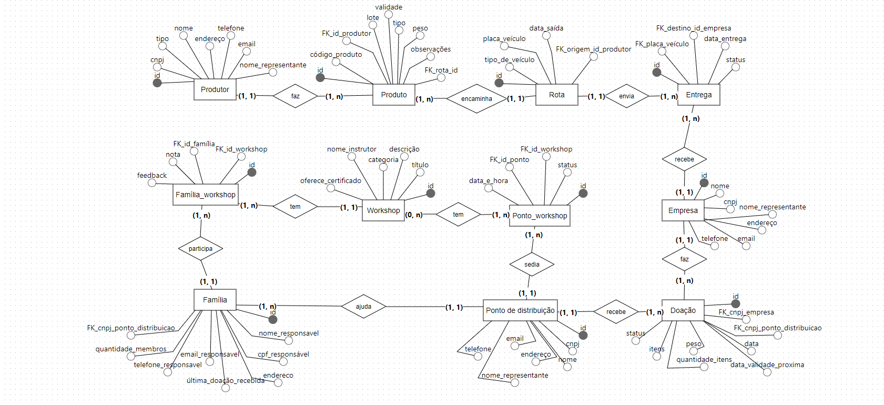
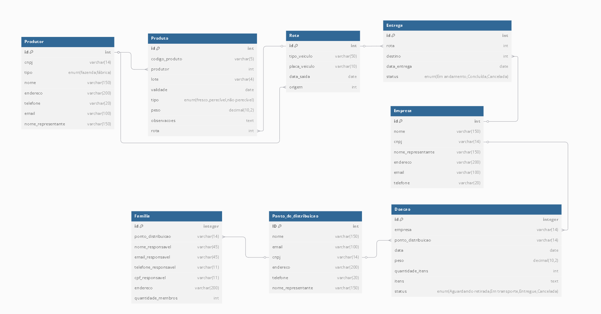

<h1 align='center'>Nome do Projeto</h1>

> Projeto do **Squad 6** para o Módulo 3 do curso **Desenvolvimento Web Full-Stack**, do [Programadores do Amanhã](https://programadoresdoamanha.org.br/pt) - Criatividade analista 🔎
### "Em 2019, foi jogado fora quase um bilhão de toneladas de alimentos. 690 milhões de pessoas estavam subnutridas no mundo no mesmo ano"    "Enquanto o Brasil é um dos maiores exportadores de insumos agrícolas do mundo, os brasileiros sofrem com a desigualdade na distribuição de alimentos e a fome." 
>#### Fontes: [UNEP](https://www.unep.org/pt-br/noticias-e-reportagens/reportagem/como-o-desperdicio-de-alimentos-esta-destruindo-o-planeta), [OXFAM](https://www.oxfam.org.br/blog/desperdicio-de-alimentos-entenda-suas-consequencias/)

## ❗ As problemáticas 
Você já ouviu falar que a produção de alimentos é mais que suficiente para alimentar toda a população? Se sim, você com certeza já se perguntou para onde vai toda essa comida. Eu te conto: toneladas e mais toneladas vão direto para o lixo. Porque são mal distribuídas, e muita gente não sabe fazer o estoque de certos alimentos da forma correta. O desperdício acontece em todas as etapas da cadeia alimentar — na produção em fazendas, no transporte, no consumo final... Depois que estraga, a única opção que as pessoas veem é jogar no lixo, porque também não sabem reaproveitar esses alimentos.

## ❓ As possíveis soluções
Deste ponto de partida, é necessário pensar em soluções viáveis que possam diminuir a quantidade de desperdício. A chave principal para esse problema, é ligar quem quer ajudar com quem precisa de ajuda. Produtores, restaurantes, supermercados, entre outros, podem atuar como um dos principais agentes para que essa mudança aconteça, tendo ONGs, igrejas e pontos de coletas para que suas doações cheguem a famílias carentes de todo o Brasil. Além disso, é importantíssimo instruir sobre o aproveitamento dos alimentos. Só a compostagem e a reciclagem já podem diminuir drasticamente o desperdício.  

## 🎯 O sistema
em construção

## 🆕 Nosso diferencial
Apesar de já existirem iniciativas semelhantes, nosso projeto se destaca por trabalhar tanto com doações quanto com a educação dos consumidores, incentivando o aproveitamento total dos alimentos e suas embalagens, além de incentivar a agricultura familiar.

## 💭 Diagrama conceitual
- Tecnologia usada: BRMW
- [Link para melhor visualização](https://app.brmodeloweb.com/#!/publicview/67bf1540a68fde8eca2b836e)

    

## 💬 Diagrama lógico
- Tecnologia usada: DBDIAGRAM
- [Link para melhor visualização](https://dbdiagram.io/d/projeto-final-m3-67ab75ef263d6cf9a0cb0760)

    

## 👥 Colaboradores
- [Désiree](https://github.com/Desiree2522)
- [Hadiel](https://github.com/hadiel7)
- [Jhulyanne](https://github.com/jhulyanne)
- [Luana](https://github.com/LuanaAguilar2)
- [Silas](https://github.com/SilasCorreia8)
- [Stacy](https://github.com/stacylinda17)
- [Yasmin](https://github.com/YasmimResendes)