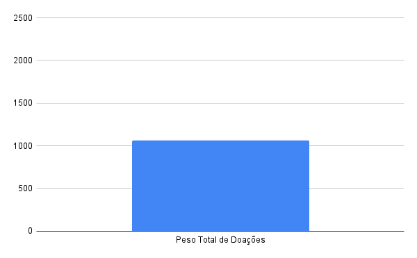

### 1 - Itens das doações com status "Entregue"
O gráfico a seguir apresenta os itens das doações que já foram entregues, oferecendo uma visão sobre quais tipos de produtos estão sendo mais doados e efetivamente chegando aos destinatários. Essa análise ajuda a entender a distribuição dos itens doados e a possível necessidade de ajustes na arrecadação.

> O gráfico representa a consulta número 1 de [Doação](doacao.sql)

### 2 - Peso total das doações
O gráfico a seguir exibe o peso total de todas as doações cadastradas no sistema. Esse dado é fundamental para monitorar a logística de transporte e armazenamento, garantindo uma distribuição eficiente e equilibrada dos itens doados.

> O gráfico representa a consulta número 3 de [Doação](doacao.sql)