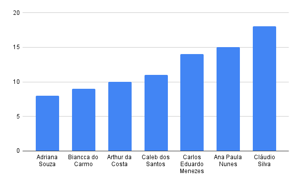
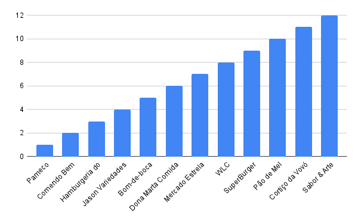

### Distribuição dos representantes por inicial do nome
O gráfico a seguir apresenta a distribuição dos representantes das empresas cadastradas no sistema, considerando apenas aqueles cujos nomes começam com as letras de A a D. Essa segmentação permite uma análise específica desse grupo dentro do total de representantes.

> O gráfico representa a consulta número 1 de [Empresa](empresa.sql)

### Distribuição dos IDs das empresas
O gráfico abaixo exibe a distribuição das empresas cadastradas no sistema com base em seus respectivos IDs. Essa visualização facilita a identificação da quantidade e organização das empresas dentro do banco de dados.

O gráfico representa a consulta número 3 de Empresa

> O gráfico representa a consulta número 3 de [Empresa](empresa.sql)