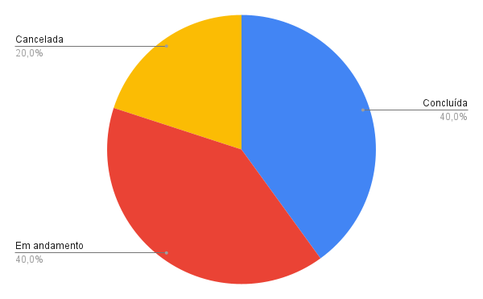
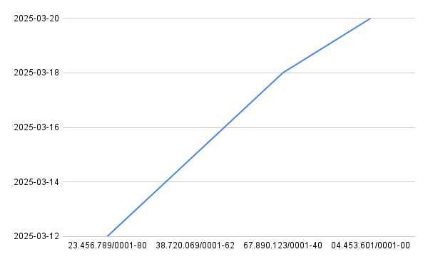

### Porcentagem de entregas por status
O gráfico a seguir apresenta a distribuição percentual das entregas cadastradas no sistema, classificadas em três status: cancelada, em andamento e concluída. Essa visualização permite acompanhar a proporção de entregas bem-sucedidas e identificar possíveis gargalos no processo logístico.

> O gráfico representa a consulta número 2 de [Entrega](entrega.sql)

### Relação de datas de entregas por CNPJ
O gráfico abaixo exibe a relação entre as datas de entrega e os diferentes CNPJs das empresas envolvidas no processo. Essa análise facilita o monitoramento das entregas ao longo do tempo, permitindo identificar padrões e otimizar a gestão logística.

> O gráfico representa a consulta número 3 de [Entrega](entrega.sql)
