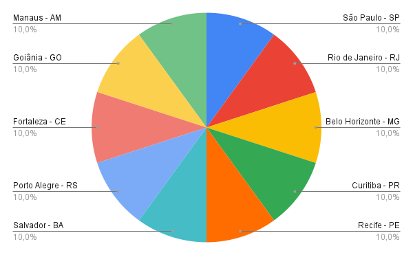
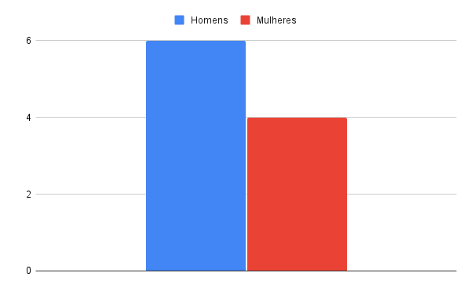

### Distribuição de pontos de distribuição por cidade
O gráfico a seguir mostra a distribuição dos pontos de distribuição por cidade, ilustrando quantos pontos existem em cada local. Essa análise permite identificar a concentração de pontos e a possível necessidade de expansão ou otimização em algumas regiões.

> O gráfico representa a consulta número 1 de [Ponto de distribuição](ponto-de-distribuico.sql)

### Distribuição de representantes de pontos de distribuição por gênero
O gráfico a seguir apresenta a quantidade de representantes de pontos de distribuição, diferenciados por gênero. Isso permite uma análise sobre a diversidade de gênero nos representantes desses pontos, fornecendo uma visão importante sobre a composição da força de trabalho.

> O gráfico representa a consulta número 3 de [Ponto de distribuição](ponto-de-distribuico.sql)