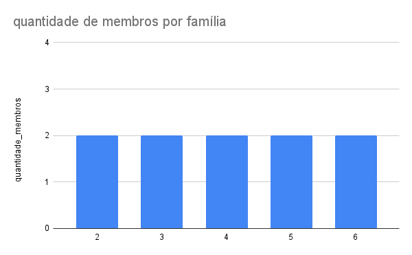
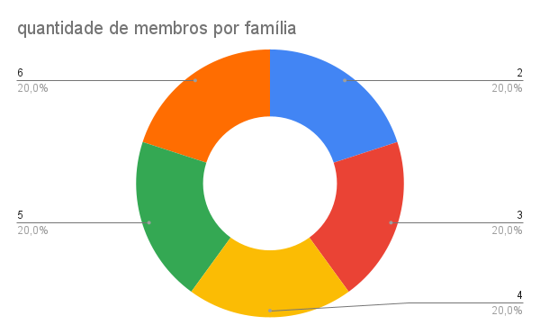

### 1 - Distribuição de workshops por mês
O gráfico a seguir apresenta a quantidade de workshops realizados ao longo dos meses. Essa análise permite identificar períodos de maior e menor atividade, auxiliando no planejamento e organização dos próximos eventos.

> O gráfico representa a consulta número 4 de [Ponto-Workshop](ponto-workshop.sql)

### 2 - Distribuição de workshops por status
O gráfico abaixo exibe a quantidade de workshops cadastrados no sistema, classificados conforme seu status. Essa categorização facilita o acompanhamento dos workshops já concluídos, em andamento e pendentes.

> O gráfico representa a consulta número 3 de [Ponto-Workshop](ponto-workshop.sql)