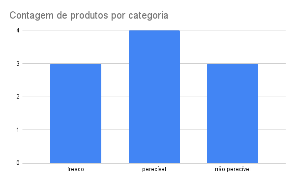
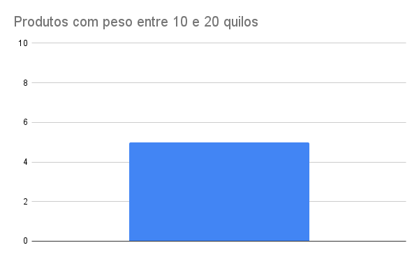

### Contagem de produtos por categoria 
O gráfico a seguir exibe uma quantidade de produtos cadastrados no sistema, classificados em três categorias: fresco , perecível e não perecível .
Atualmente, há 3 produtos afrescos , 4 perecíveis e 3 não perecíveis . Isso indica um aumento na quantidade de produtos perecíveis em relação às outras categorias, enquanto os produtos frescos e não perecíveis possuem a mesma quantidade.

> o gráfico representa a consulta número 3 do banco de dados [Produto](produto.sql)

### Produtos com peso entre 10 e 20 quilos
O gráfico abaixo mostram a quantidade de produtos cadastrados no sistema cujo peso está entre 10 e 20 quilos.
Atualmente, há 5 produtos com peso superior a 10 quilos e inferior a 20 quilos.

> O gráfico representa a consulta número 5 do banco de dados [Produto](produto.sql)