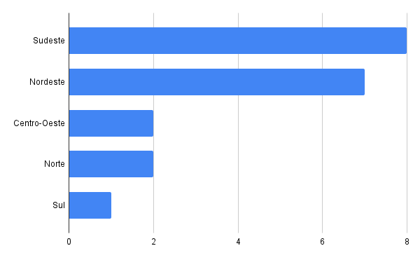

### 1 - Distribuição dos tipos de produtores
O gráfico a seguir apresenta a distribuição dos produtores cadastrados no sistema, categorizados em dois tipos: fazendas e fábricas. Observa-se que há um total de 10 fazendas e 10 fábricas, indicando uma divisão equilibrada entre os dois tipos de produtores.

> O gráfico representa a consulta número 2 de [Produtor](produtor.sql)

### 2 - Distribuição dos produtores por região
O gráfico a seguir apresenta a distribuição dos produtores cadastrados no sistema, categorizados de acordo com a região correspondente ao seu DDD. Observa-se que a maior concentração de produtores está na região Sudeste, seguida pelo Nordeste e Sul.

> O gráfico representa a consulta número 4 de [Produtor](produtor.sql)