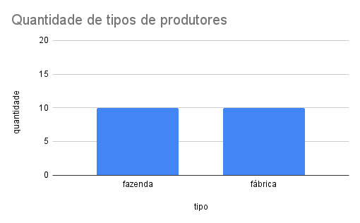

### Distribuição dos tipos de produtores

O gráfico a seguir apresenta a distribuição dos produtores cadastrados no sistema, categorizados em dois tipos: fazendas e fábricas. Observa-se que há um total de 10 fazendas e 10 fábricas, indicando uma divisão equilibrada entre os dois tipos de produtores.

O gráfico representa a consulta 2 de [Produtor](produtor.sql)

