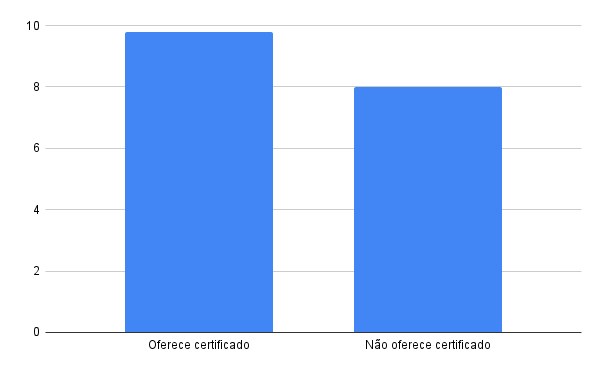

### 1 - Média de notas dos workshops com e sem certificado
O gráfico a seguir apresenta a média de avaliação dos workshops cadastrados no sistema, diferenciando aqueles que oferecem certificado dos que não oferecem. Essa análise permite verificar se a certificação influencia na percepção de qualidade dos participantes.

* O gráfico representa a consulta número 2 de [Wokshop](workshop.sql)

### 2 Distribuição dos workshops por categoria
O gráfico a seguir apresenta a quantidade de workshops cadastrados no sistema, distribuídos por categoria. Essa visualização ajuda a identificar quais tipos de workshops são mais ofertados e quais possuem menor presença na base de dados.

* O gráfico representa a consulta número 3 de [Wokshop](workshop.sql)